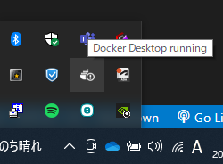
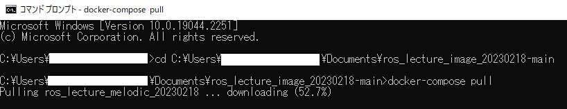
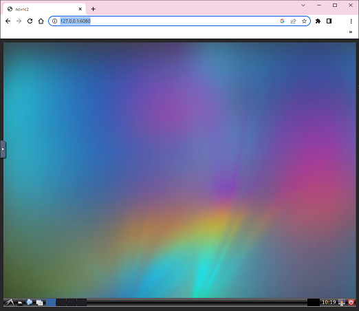

# ros_lecture_melodic_202302

## Docker イメージのインストール

通信の良好な環境にて実施してください。

[ros_lecture_melodic_202302-main.zip](https://github.com/KMiyawaki/ros_lecture_melodic_202302/archive/refs/heads/main.zip)をダウンロードし展開してください。ここでは`C:\Users\[ユーザ名]\Documents\ros_lecture_melodic_202302-main`に展開したとします。

なお、`[ユーザ名]`には`Windows`のログインユーザ名が入ります。以降も同様です。

展開後のフォルダには以下のファイルが含まれています。

```text
    docker-compose.yml
    README.md
```

まず[Docker Desktop for Windows](https://docs.docker.com/desktop/install/windows-install/)を**必ず起動してください**。

以下の画面のようにWindowsのタスクトレイに`Docker Desktop for Windows`のアイコンが表示されていることを確認し、次の手順に移ってください。



`Docker Desktop for Windows`の起動を確認できたら`Windows`のコマンドプロンプトを起動し、次のコマンドを入力してください。

```cmd
cd C:\Users\[ユーザ名]\Documents\ros_lecture_melodic_202302-main
docker-compose pull
```

以下の画面のように環境のダウンロードが始まります。



次のようなメッセージが出たら終了です。

```cmd
Pulling ros_lecture_melodic_202302 ... done
```

終了したら次のコマンドを入力してください。

```cmd
docker images
```

次のように`melodic_202302`のイメージがダウンロードされていれば成功です。

```cmd
REPOSITORY                TAG                IMAGE ID       CREATED          SIZE
kmiyawaki20/ros_lecture   melodic_202302   84e6beb6986c   22 minutes ago   3.81GB
```

## 起動

以下の画面のようにWindowsのタスクトレイに`Docker Desktop for Windows`のアイコンが表示されていることを確認し、次の手順に移ってください。

`Docker Desktop for Windows`が起動されていなければ、起動してから次の手順に移ってください。


`Docker Desktop for Windows`の起動を確認できたら、次のコマンドを入力してください。

```cmd
cd C:\Users\[ユーザ名]\Documents\ros_lecture_melodic_202302-main
docker-compose up
```

次のようなメッセージが出力されます。

このコマンドを起動したターミナルは作業終了までは閉じないでください。

```cmd
Creating network "ros_lecture_melodic_202302-main_default" with the default driver
・・・
ros_lecture_melodic_202302    | 2022-12-11 10:17:10,640 INFO success: x11vnc entered RUNNING state, process has stayed up for > than 1 seconds (startsecs)
・・・
```

任意のWEBブラウザで[http://127.0.0.1:6080/](http://127.0.0.1:6080/)に接続してください。次のように`Linux`の`GUI`が表示されれば成功です。



## 終了

WEBブラウザを閉じ、起動コマンドを実行したコマンドプロンプトで`Ctrl`キーと`C`キーを同時に押してください。

もし、終了しなければ２，３回`Ctrl`キーと`C`キーを同時に押してください。それでも終了しない場合は起動コマンドを実行したコマンドプロンプトを閉じてください。
