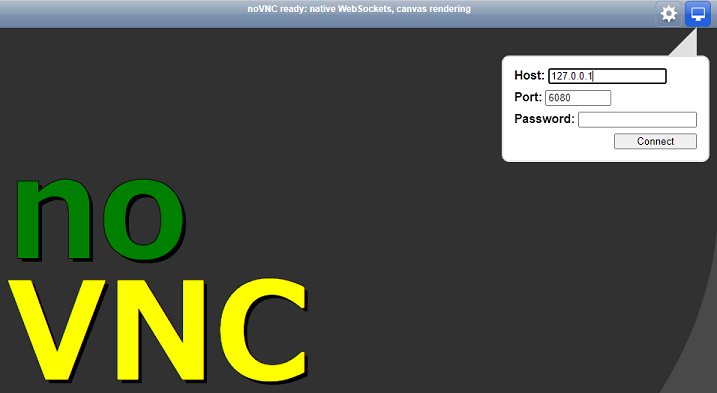
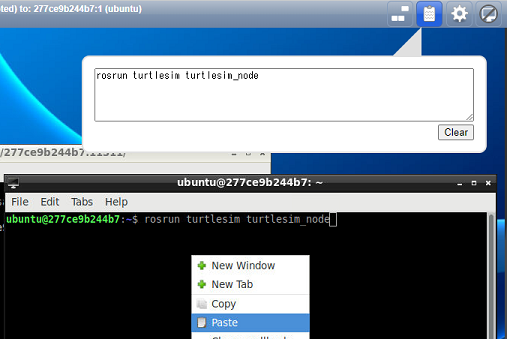

# ros_lecture_melodic_202302

## Docker イメージのインストール

Wifi通信の良好な環境にて実施してください。

[ros_lecture_melodic_202302-main.zip](https://github.com/KMiyawaki/ros_lecture_melodic_202302/archive/refs/heads/main.zip)をダウンロードし展開してください。ここでは`C:\Users\[ユーザ名]\Documents\ros_lecture_melodic_202302-main`に展開したとします。

なお、`[ユーザ名]`には`Windows`のログインユーザ名が入ります。以降も同様です。

展開後のフォルダには以下のファイルが含まれています。

```text
    docker-compose.yml
    README.md
    images # 説明文書の画像
```

まず[Docker Desktop for Windows](https://docs.docker.com/desktop/install/windows-install/)が**起動していることを必ず確認してください**。

以下の画面のようにWindowsのタスクトレイに`Docker Desktop for Windows`のアイコンが表示されていることを確認し、次の手順に移ってください。  
アイコンの表示が無ければ、`Windows`の[アプリ検索](https://support.microsoft.com/ja-jp/windows/%E3%81%99%E3%81%B9%E3%81%A6%E3%81%AE%E3%82%A2%E3%83%97%E3%83%AA%E3%81%A8%E3%83%97%E3%83%AD%E3%82%B0%E3%83%A9%E3%83%A0%E3%82%92%E6%A4%9C%E7%B4%A2%E3%81%99%E3%82%8B-cadb9c4b-459d-dfcb-2964-14aac1d7d964)で`Docker Desktop for Windows`を検索して実行してください。


`Docker Desktop for Windows`の起動を確認できたら`Windows`のコマンドプロンプトを起動し、次のコマンドを入力してください。  
なお、ファイルパスの`\`バックスラッシュは（円マーク）を意味しています。

```cmd
cd C:\Users\[ユーザ名]\Documents\ros_lecture_melodic_202302-main
docker-compose pull
```

以下の画面のように環境のダウンロードが始まります。


終了したら次のコマンドを入力してください。

```cmd
docker images
```

次のように`melodic_202302`のイメージがダウンロードされていれば成功です。  
`76e6332fcd35   22 minutes ago   3.81GB`の部分は多少異なる可能性があります。

```cmd
REPOSITORY                TAG                IMAGE ID       CREATED          SIZE
kmiyawaki20/ros_lecture   melodic_202302   76e6332fcd35   22 minutes ago   3.81GB
```

## 起動

以下の画面のようにWindowsのタスクトレイに`Docker Desktop for Windows`のアイコンが表示されていることを確認し、次の手順に移ってください。

`Docker Desktop for Windows`が起動されていなければ、起動してから次の手順に移ってください。


`Docker Desktop for Windows`の起動を確認できたら、次のコマンドを入力してください。

```cmd
cd C:\Users\[ユーザ名]\Documents\ros_lecture_melodic_202302-main
docker-compose up
```

次のようなメッセージが出力されます。

このコマンドを起動したターミナルは作業終了までは閉じないでください。

```cmd
 - Network ros_lecture_melodic_202302-main_default  Created                                                      0.8s
 - Volume "ros_lecture_melodic_202302-main_ubuntu"  Created                                                      0.0s
 - Container ros_lecture_melodic_202302             Created                                                      8.7s
Attaching to ros_lecture_melodic_202302
・・・
ros_lecture_melodic_202302  | **********************************************
ros_lecture_melodic_202302  | * Open 'http://127.0.0.1:6080/vnc.html'      *
ros_lecture_melodic_202302  | * Or access '127.0.0.0:5901' via VNC viewer. *
ros_lecture_melodic_202302  | **********************************************
```

任意のWEBブラウザで[http://127.0.0.1:6080/vnc.html](http://127.0.0.1:6080/vnc.html)に接続してください。  
次のような画面が出ますので、`Connect`を押してください。パスワードは不要です。



次のように`Linux`の`GUI`が表示されれば成功です。


もしも、`Linux`のデスクトップ画面が大きすぎてブラウザに入りきらない場合は`docker-compose.yml`をメモ帳で次のように変更してください。

```yaml
・・・
    environment:
      - USER=ubuntu
      - RESOLUTION=1024x600 # RESOLUTION=1280x800の数値を小さくする
      - TZ=Asia/Tokyo
    tty: true
・・・
```

編集後、以下の[終了](#終了)で一旦終了してから再度[起動](#起動)をしてみてください。

## 終了

WEBブラウザを閉じ、起動コマンドを実行したコマンドプロンプトで`Ctrl`キーと`C`キーを同時に押してください。

もし、終了しなければ２，３回`Ctrl`キーと`C`キーを同時に押してください。それでも終了しない場合は起動コマンドを実行したコマンドプロンプトを閉じてください。

## ROSの動作確認

練習のために、できれば一度PCを再起動し、上記の「[起動](#起動)」をもう一度実施してみてから次の手順に移ってください。

### コマンドターミナルの起動とTurtlesim

WEBブラウザで表示されている`Linux`の`GUI`（以降単に`Linux`と表記します）のコマンドターミナルを起動してください。  
画面左下のアイコンをクリックし、`System Tools`->`LXTerminal`をクリックします。


コマンドターミナルで`roscore`を入力してエンターキーを押してください。実行結果は次の通りです。


このコマンドターミナルは動作確認終了までは閉じないでください。

再度`System Tools`->`LXTerminal`をクリックして、もう一つコマンドターミナルを開き、次のコマンドを実行してください。

```shell
rosrun turtlesim turtlesim_node
```

なお、WEBブラウザ上での`Linux`に対し`Windows`側でコピーしたテキストを単純な方法ではペーストすることはできません。`Linux`->`Windows`も不可能です。  
`Linux`->`Linux`へのコピー＆ペーストは可能です。

`Windows`->`Linux`へのコピー＆ペーストをする場合は画面右上のクリップボードアイコンをクリックし、そこにテキストをペーストしてください。  
その後、`Linux`側で右クリックからペーストを行ってください。



`Linux`->`Windows`の場合は`Linux`側でコピーしたテキストが自動的にクリップボードに表示されますので、それを利用してください。

`rosrun turtlesim turtlesim_node`を実行すると次の画面のように青いウィンドウと亀のキャラクタが表示されます。キャラクタは表示のたびに変わります。


確認が終わったら`rosrun turtlesim turtlesim_node`を起動したターミナルで`Ctrl+C`を押して終了させてください。

### talkerとlistener

画面左下のアイコンをクリックし、`System Tools`->`LXTerminal`をクリックして、新しいコマンドターミナルを起動し、次のコマンドを実行してください。

```shell
rosrun beginner_tutorials talker.py
# 以下実行結果
[INFO] [1671266060.656336]: hello world 1671266060.66
[INFO] [1671266060.756805]: hello world 1671266060.76
[INFO] [1671266060.856629]: hello world 1671266060.86
・・・
```

もう一つコマンドターミナルを起動し次のコマンドを実行してください。

```shell
rosrun beginner_tutorials listener.py 
# 以下実行結果
[INFO] [1671266176.099021]: /listener_18191_1671266175889I heard hello world 1671266176.1
[INFO] [1671266176.197755]: /listener_18191_1671266175889I heard hello world 1671266176.2
[INFO] [1671266176.297876]: /listener_18191_1671266175889I heard hello world 1671266176.3
・・・
```

もう一つコマンドターミナルを起動し次のコマンドを実行してください。

```shell
rqt_graph
```

次のような画面が出たら成功です。すべてのターミナルを`Ctrl+C`で終了させてください。


### ロボットシミュレータ

前項と同じ要領で`LXTerminal`を起動し、次のコマンドを入力してください。

```shell
roslaunch oit_navigation_minibot_light_01 stage_navigation.launch
```

シミュレータが起動しますので、`2D Nav Goal`ボタンを押して、地図上の適当な場所をクリックしてください。  
ロボットが経路を計画し、自律移動します。場所によってはたどりつけないこともありますが、問題はありません。
目的地においてマウスドラッグすることで到着時の方向を指定することができます。

以下の動画のデスクトップの背景やウィンドウのタイトルバーなどが、配布している開発環境で実行した場合は異なることがありますが、問題はありません。


シミュレータは起動コマンドを入力した`LXTerminal`で`Ctrl+C`を押して終了させてください。

## VSCodeとの連携

`VSCode`の拡張機能から`Docker`、`Dev Containers`、`Remote Development`を選択してインストールしてください。


インストール後は`VSCode`を一旦再起動してください。

[起動](#起動)の項目で実施した`docker-compose up`が正常に実行され、WEBブラウザで[http://127.0.0.1:6080/vnc.html](http://127.0.0.1:6080/vnc.html)に接続可能なことを確認してから、次の手順に移ってください。

`VSCode`のリモートエクスプローラをクリックして`Containers`をクリックしてください。  


`ros_lectures_melodic_202302`があるはずですので、それをクリックしてください。  
さらに、`Attach to Container`をクリックしてください。


次のようなダイアログが出た場合は`Got It`をクリックしてください。


`VSCode`が`Linux`に接続します。以下のような表示が出ることがありますが、問題はありません。「今後表示しない」や「X（バツボタン）」をクリックして次に進んでください。


左下の方に`Container kmiyawaki20/ros_lectures...`という表示が出ていることを確認してください。  
左側のフォルダを開くアイコンをクリックし、`/home/ubuntu/catkin_ws/src`を選択してください。


`/home/ubuntu/catkin_ws/src/beginner_tutorials/scripts/listener.py`をダブルクリックし、エディタで表示できることを確認してください。


`Ctrl+Shift+@`を同時に押してください。`VSCode`上でコマンドターミナルが開きます。  
`Ctrl+Shift+@`の同時押しを繰り返せばターミナルは複数個開くことができます。  
不要なターミナルは`exit`コマンド、もしくはゴミ箱のボタンを押すことで閉じることができます。


練習のために、`roscore`、`rosrun beginner_tutorials talker.py`、`rosrun beginner_tutorials listener.py`を`VSCode`から実行してみてください。

なお、シミュレータ`roslaunch oit_navigation_minibot_light_01 stage_navigation.launch`を含むGUIのソフトを`VSCode`から実行することはできません。

基本的な開発の流れとしては次のようになります。

1. WEBブラウザ上の`Linux`でシミュレータを起動する。
2. `VSCode`を`Linux`に接続し、`Python`コード編集を行う。
3. `VSCode`のターミナルから`Python`コードを実行する。

## VNCクライアントの利用（オプション）

VNCクライアントソフトを入れることで少し作業がしやすくなります。

1. コピー＆ペーストがダイレクトにできるようになる。
2. `Linux`側ターミナルで`Shift+Ctrl+T`によりタブを増やすことができる。
   - １つのターミナルウィンドウに複数のコマンド実行用のタブを作成できるのでデスクトップ画面がすっきりする。

VNCクライアントソフトには様々なものがありますが、ここでは[Real VNC](https://www.realvnc.com/en/connect/download/viewer/)を使います。リンクからダウンロードし、インストールしてください。

インストール後、`VNC Viewer`を実行し、接続先に`127.0.0.1:5901`を入力してエンターを押してください。

`Unencrypted Connection`の警告が出ますが`Don't warn me`にチェックを入れて`Continue`をクリックしてください。


WEBブラウザのときと同じように`Linux`のデスクトップにアクセスできます。  
ターミナルソフトを起動して`Shift+Ctrl+T`を押すと、ターミナル内でタブを作成することができます。
ターミナルに`Windows`側からコピーしたコマンドを右クリックでペーストできます。


`VNC Viewer`で接続した`Linux`デスクトップ表示の色数が少ない場合は、一旦`Linux`を「X」（バツボタン）で閉じ、`VNC Viewer`の下記画面で`127.0.0.1:5901`の接続先アイコンを右クリックし、`Properties`の画面を開いてください。


`Options`の`Picture quality`を`HIGH`にして`OK`を押してください。  


設定後、`127.0.0.1:5901`の接続先アイコンをダブルクリックして再接続してください。
